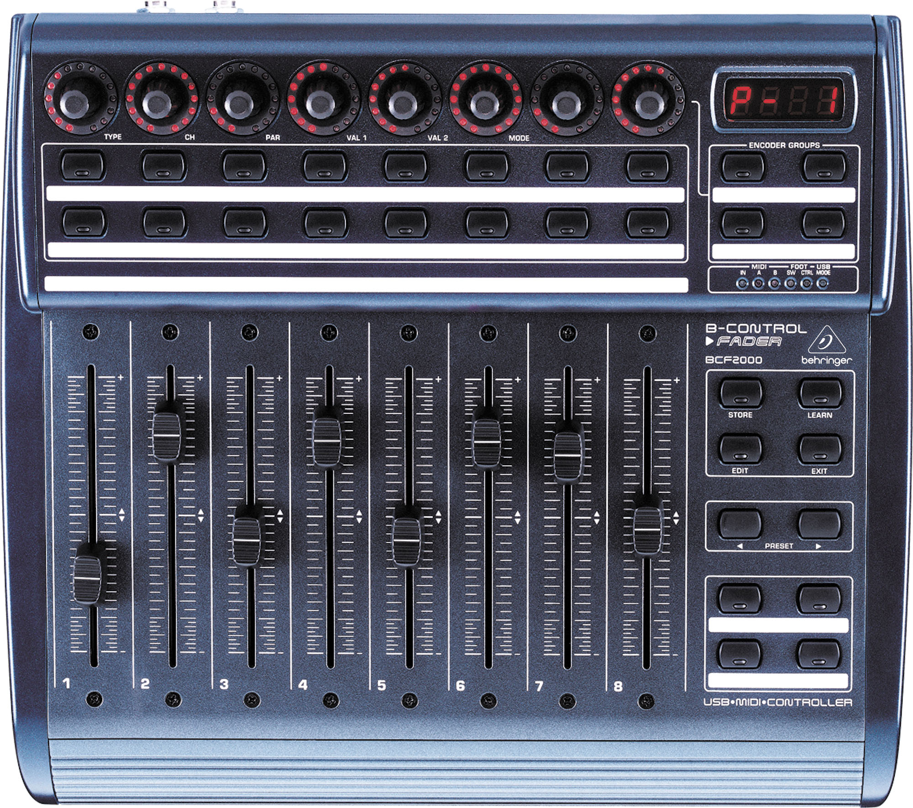

# MIDI Controller Driver

This is a driver written in Python that interfaces with Behringer MIDI Controller device. It works by reading input signals from knobs, sliders, or buttons of the controller, and maps them into values of physical quantities like joint position, velocity, voltage, current, etc. which are defined in YAML config file. It then wraps these quantities as ROS messages and publishes to back-end subscribers.

It also supports virtual MIDI board to allow users interact on GUI without actual hardware. It can be extended to other protocol other than ROS and configured to do any cool thing out of your imagination with knobs, sliders, buttons with very minimal effort.



## Prerequisites

1. Python 3.x


2. [python-rtmidi](https://github.com/SpotlightKid/python-rtmidi)

3. python-yaml (via apt-get)

4. python-enum34 (via apt-get)


## Installation

```bash
cd catkin_ws/
catkin_make
```


## Usage

```python
# Runs MIDI controller only
python scripts/midi_board --config_file=path_to_yaml
# Runs both MIDI controller and virtual MIDI controller
python scripts/midi_board_virtual --config_file=path_to_board_virtual_yaml
# Runs virtual MIDI controller only
python scripts/virtual_midi_board --config_file=path_to_virtual_yaml

```

Although the driver only supports ROS protocol currently, it can be easily extended to other protocols (CAN, etc.) just by creating a new protocol-specific adapter class that inherits base Adapter class (adapter.py) and implements protocol specific functions. See src/midi_board/adapters for example. This is a typical usage of [Adapter Pattern](https://en.wikipedia.org/wiki/Adapter_pattern) 

To define and configure the functionality of MIDI device knobs, sliders and buttons for your purpose (for ex, knob id #1 to adjust current values, slider id #11 to adjust joint position values, define max and min values, or define python function to execute when state changes), you need to create a YAML file following the templates in config folder. Note: virtual MIDI board requires a separate YAML file (see config/\*_virtual.yaml), and virtual-physical MIDI board combination requires a separate YAML file (see config/\*__board_virtual.yaml). [MVC pattern](https://en.wikipedia.org/wiki/Model–view–controller) is used to separate logic and GUI.

## Demo

Demo of virtual MIDI controller interacting with UR10 Industrial Arm in RViz

[](https://youtu.be/rXH3AveKi_0)

## License
The MIT License.
